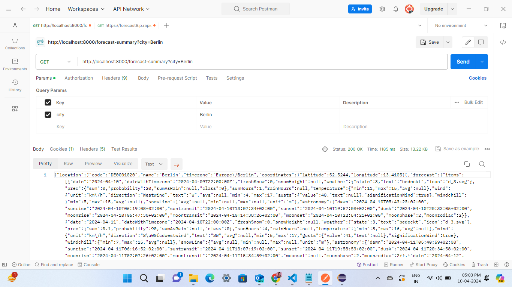
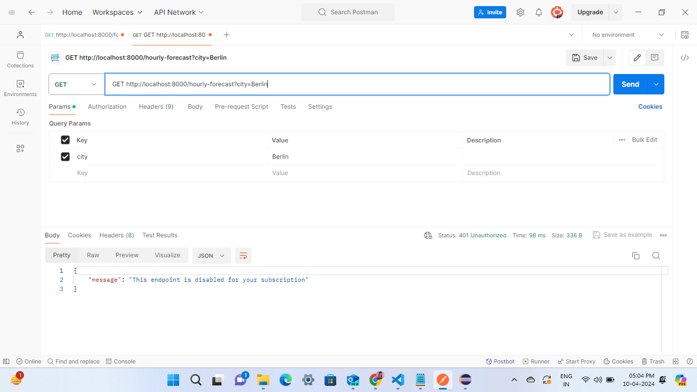

# Spring Boot Weather API

This is a Spring Boot application that provides endpoints to retrieve weather forecast information using RapidAPI.

## Features

- Retrieve weather forecast summary of any city
- Get hourly weather forecast details of any city

## Prerequisites

- Java Development Kit (JDK) version 8 or higher
- Maven
- RapidAPI subscription with access to the weather forecast APIs

## Installation

1. Clone the repository:

   ```
   git clone https://github.com/Snehal-Salvi/weather-api
   ```

2. Navigate to the project directory:

```
cd weatherApi
```

3. Open the src/main/resources/application.properties file and replace your-rapidapi-key with your actual RapidAPI key.

4. Build the project using Maven:

```
mvn clean install
```

5. Run the application.

```
java -jar target/weatherApi-0.0.1-SNAPSHOT.jar
```

## Usage

### Get Weather Forecast Summary

Send a GET request to `/forecast-summary` endpoint with a `city` parameter to get the weather forecast summary for the specified city.

#### Example:

```
GET http://localhost:8000/forecast-summary?city=Berlin
```

### Get Hourly Weather Forecast

Send a GET request to /hourly-forecast endpoint with a city parameter to get the hourly weather forecast details for the specified city.

#### Example:

```
GET http://localhost:8000/hourly-forecast?city=Berlin
```

## Snapshots:

### Forecast Summary:

Description: This image shows the forecast summary for a specific city.

Note: In free subscription only 10 request per day is allowed.



### Hourly Forecast:

Description: This image displays the hourly forecast details for a specific city.

Note: Hourly forecast report is not available in free plan.



## Approach

This section outlines the approach taken to develop the Spring Boot weather API application.

### 1. Problem Identification

Identified the need to develop an API to provide weather forecast information for various cities.

### 2. Research and Planning

Researched available weather forecast APIs and selected RapidAPI as the provider. Planned the architecture and endpoints required to fulfill the application's functionality.

### 3. Setting Up the Development Environment

Configured a Spring Boot project with Maven. Integrated RapidAPI subscription to access weather forecast data.

### 4. Implementation

Implemented two main endpoints:

- `/forecast-summary`: Returns weather forecast summary for a specified city.
- `/hourly-forecast`: Returns hourly weather forecast details for a specified city.

Utilized RestTemplate to make HTTP requests to the RapidAPI endpoints and process responses.

### 5. Testing

Thoroughly tested each endpoint to ensure correct functionality and handle potential errors gracefully.

### 6. Documentation

Documented the usage of each endpoint and included examples in the README file to guide users on how to interact with the API.

## Technologies Used

- Java
- Spring Boot
- Maven
- RapidAPI

## Authors

- [@Snehal](https://github.com/Snehal-Salvi)
